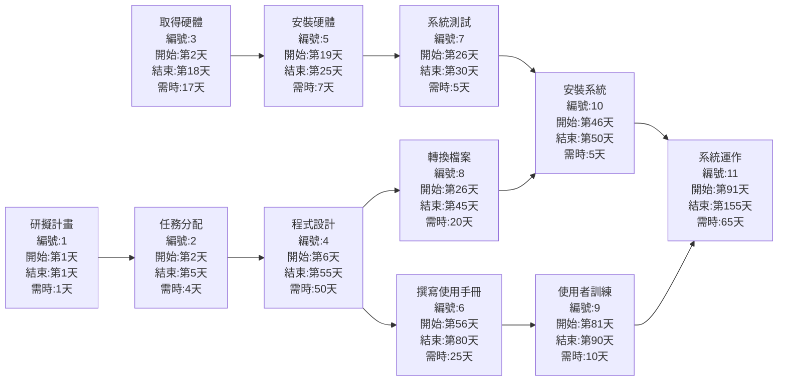
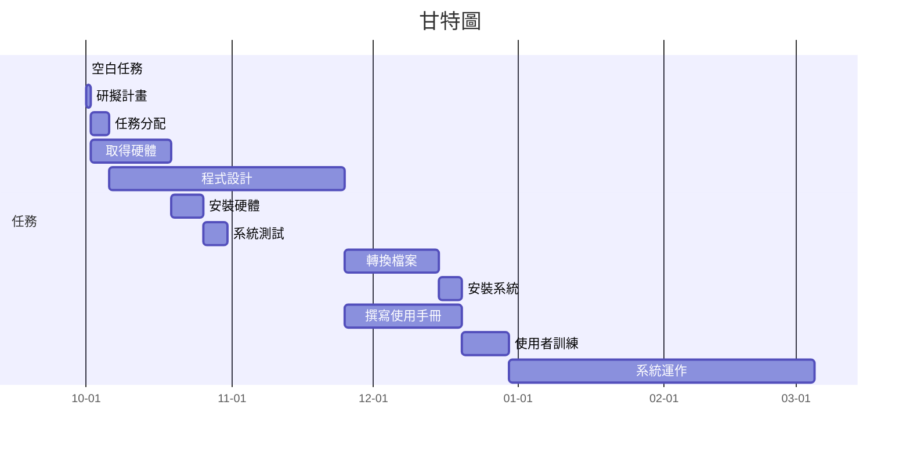

## PERT/CPM 圖

```mermaid
flowchart LR
    no1["研擬計畫<br/>編號:1<br/>開始:第1天<br/>結束:第1天<br/>需時:1天"]
    no2["任務分配<br/>編號:2<br/>開始:第2天<br/>結束:第5天<br/>需時:4天"]
    no3["取得硬體<br/>編號:3<br/>開始:第2天<br/>結束:第18天<br/>需時:17天"]
    no4["程式設計<br/>編號:4<br/>開始:第6天<br/>結束:第55天<br/>需時:50天"]
    no5["安裝硬體<br/>編號:5<br/>開始:第19天<br/>結束:第25天<br/>需時:7天"]
    no6["撰寫使用手冊<br/>編號:6<br/>開始:第56天<br/>結束:第80天<br/>需時:25天"]
    no7["系統測試<br/>編號:7<br/>開始:第26天<br/>結束:第30天<br/>需時:5天"]
    no8["轉換檔案<br/>編號:8<br/>開始:第26天<br/>結束:第45天<br/>需時:20天"]
    no9["使用者訓練<br/>編號:9<br/>開始:第81天<br/>結束:第90天<br/>需時:10天"]
    no10["安裝系統<br/>編號:10<br/>開始:第46天<br/>結束:第50天<br/>需時:5天"]
    no11["系統運作<br/>編號:11<br/>開始:第91天<br/>結束:第155天<br/>需時:65天"]

    %% 任務依存關係
    no1 --> no2
    no2 --> no4
    no3 --> no5
    no4 --> no6
    no5 --> no7
    no4 --> no8
    no7 --> no10
    no8 --> no10
    no6 --> no9
    no10 --> no11
    no9 --> no11
```

## 甘特圖

```mermaid
gantt
    title 甘特圖
    dateFormat  YYYY-MM-DD
    axisFormat  %m-%d
    section 任務
    空白任務       :b0, 2025-10-01, 0d
    研擬計畫       :a1, after b0, 1d
    任務分配       :a2, after a1, 4d
    取得硬體       :a3, 2025-10-02, 17d
    程式設計       :a4, after a2, 50d
    安裝硬體       :a5, after a3, 7d
    系統測試       :a6, after a5, 5d
    轉換檔案       :a7, after a4, 20d
    安裝系統       :a8, after a6 a7, 5d
    撰寫使用手冊    :a9, after a4, 25d
    使用者訓練      :a10, after a9, 10d
    系統運作       :a11, after a10 a8, 65d
```

## 關鍵路徑
研擬計畫 → 任務分配 → 程式設計 → 撰寫使用手冊 → 使用者訓練 → 系統運作
